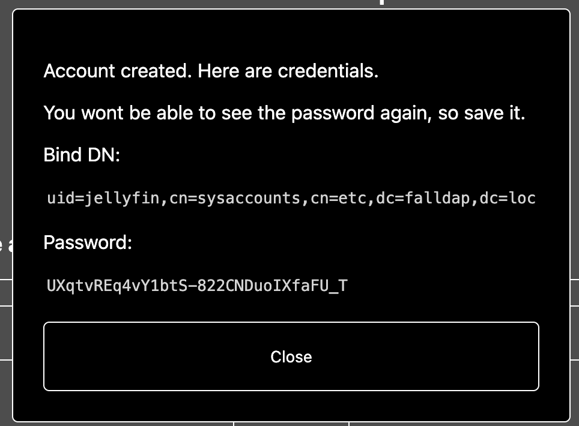
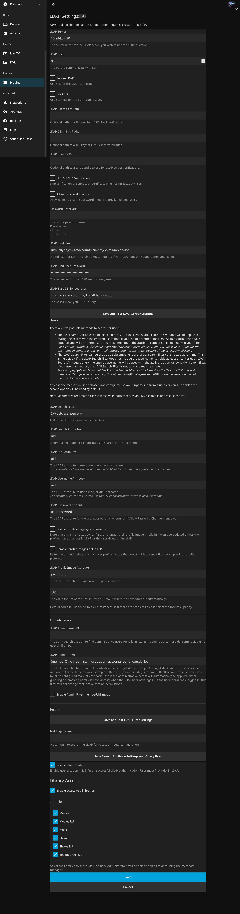

# Jellyfin

1. Install LDAP-Auth plugin from official repo
2. Go into FalLDAP admin panel (you should have _Admin panel_ button there), create account with whatever name you want, e.g. Jellyfin. You will get bind DN and password, write them down:
   
3. Configure your LDAP-Auth plugin in simillar fashion, adding desired filters.
   

4. If you use SSO-Auth plugin, set default provider to `Jellyfin.Plugin.LDAP_Auth.LdapAuthenticationProviderPlugin`
