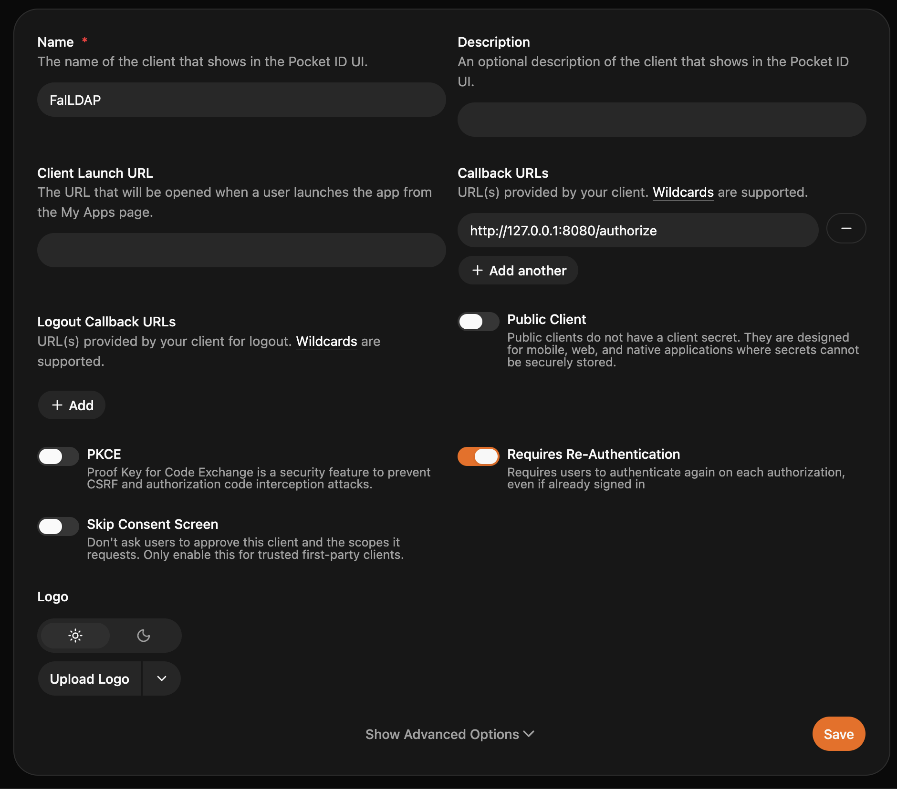
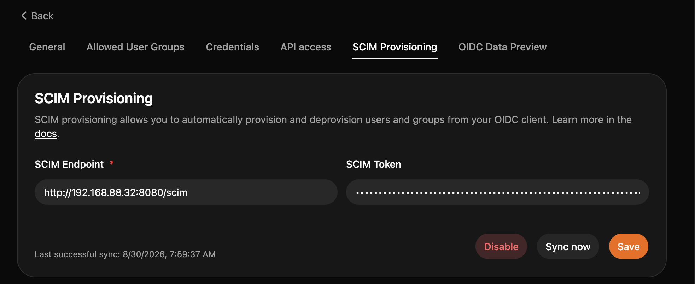
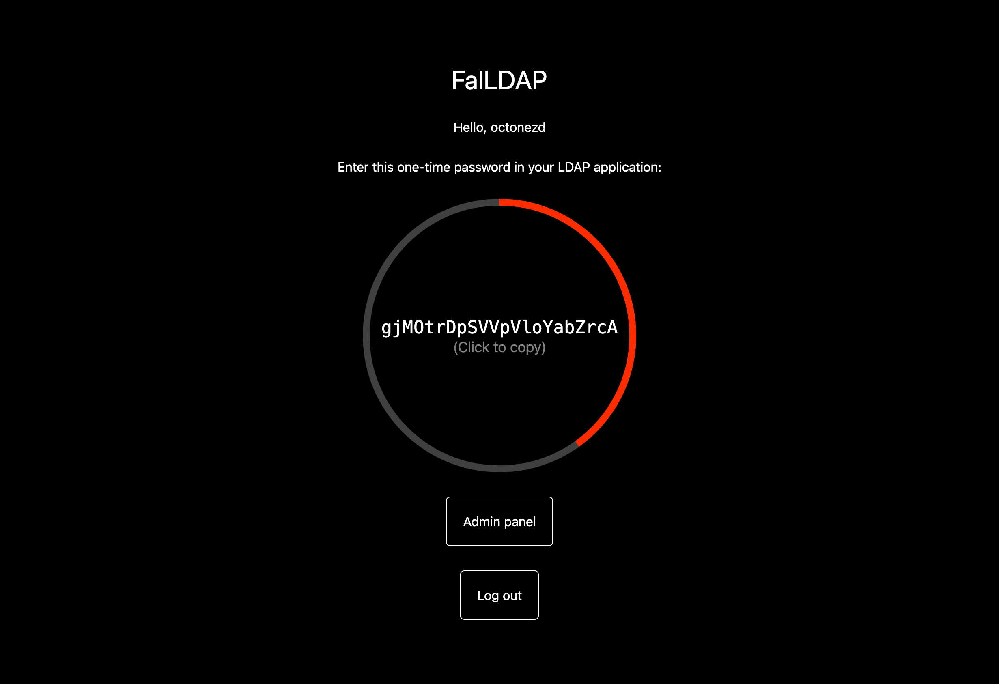

# Setup

0. [Do general env file setup](../env.md)

1. Create new OIDC app. Set it up like this, swapping http://127.0.0.1:8080 for your Pocket ID instance:



2. Go into client secret tab, generate new secret with your desired expiration date or no expiration date, write it down somewhere.
3. Go to SCIM Provisioning tab, set it up like this, swapping http://192.168.88.32:8080 for your FalLDAP server URL and SCIM token for secret you wrote in [.env setup](../env.md)
   
4. Write `client_secrets.json` file, swapping for your values:

```json
{
    "web": {
        "client_id": "CLIENT_ID_FROM_GENERAL_TAB",
        "client_secret": "WRITE_CLIENT_SECRET_HERE",
        "auth_uri": "YOUR_POCKET_ID_PATH/authorize",
        "token_uri": "YOUR_POCKET_ID_PATH/api/oidc/token",
        "userinfo_uri": "YOUR_POCKET_ID_PATH/api/oidc/userinfo",
        "issuer": "YOUR_POCKET_ID_PATH/"
    }
}
```

5. Start FalLDAP
6. Go to SCIM Provisioning tab in Pocket ID and click _Sync now_ button
7. Done. Try to log into FalLDAP now, you should see your one-time password:
   
